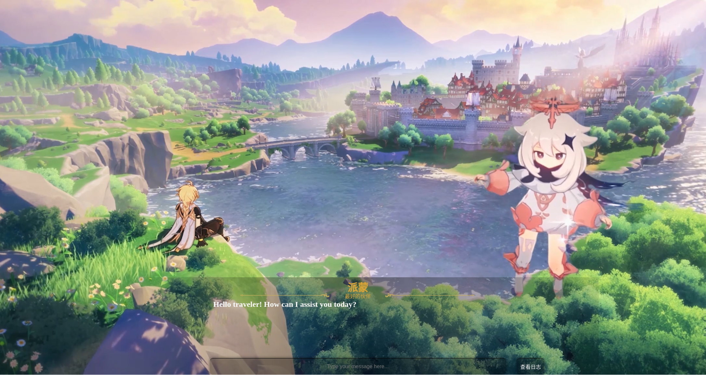

# GenshinStyleChatWebUI
A simple but lore-friendly web UI for chatting with Genshin Impact characters, with a dynamic background (a video).

Note:

- This project only contains the UI, no chatbot engine is actually provided.

### Description

This project applies flask, html, js, css scripts to implement a Genshin Impact lore-friendly chat UI.

### Requirement
~~~
pip install flask
~~~

### Quick Start

~~~
python app.py
~~~

Then open http://127.0.0.1:12346 in your browser.
